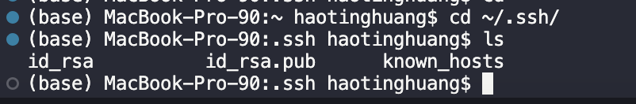
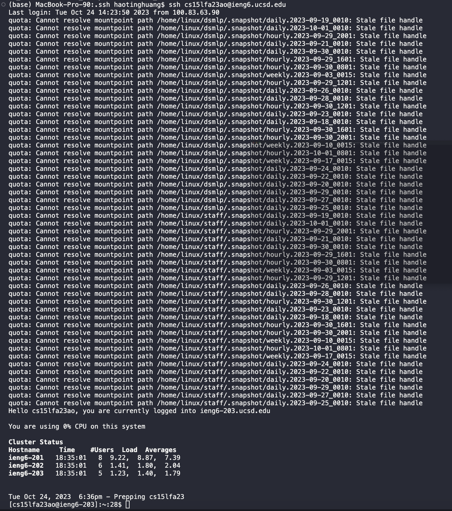

# Lab Report 2 - Servers and SSH Keys

## Part 1
Code for ```StringServer``` and ```Server```


I used the Server file provided from the previous lab assignment.

Example Calls


Which methods in your code are called? 
What are the relevant arguments to those methods, and the values of any relevant fields of the class? 
How do the values of any relevant fields of the class change from this specific request? If no values got changed, explain why.

For both examples, we start off by running the main method of the ```StringServer``` class, starting a server with the ```start``` method of the class Server and a new Handler() object from the StringServer.java file. 


The Handler will call the ```handleRequest``` method which takes a URI as input and will get that from the HttpExchange ```.getRequestURI``` method, and it will also call the ```getQuery(URI)``` 
method, which will parse the query I have entered in the link. The server starts with port 4000 in my specific case, as the input String[] args will just be an array with a singular String ```4000```, and ```int port = Integer.parseInt("4000")```.


Example 1:
- The URI input, called url, throughout the file is ```localhost:4000/add-message?=123124124124124124```.
- The port stays consistent as ```4000```.
- Before I entered the current URL, the value of ```num``` is 3, and the value of ```outputString``` is ```"1. hello\n2. gg\n3.aaaaaa"```

- The first method call is the start method of class Server, which creates a HttpServer object with socket at port 4000, and uses the Handler class in ```StringServer```.
```Server.start(4000, new Handler())```

- The HttpServer object, called server, calls a ```createContext``` method which allows it to take input, specifying paths using a forward slash character, and creates a ServerHttpHandler objects using the rules specified in the ```StringServer``` ```Handler``` class.
```Server.start(4000, new Handler())``` It will then start the server and print out a message to the terminal ```Server Started!```

- Next, I type this URL into my browser: ```localhost:4000/add-message?=123124124124124124``` Since we had declared the ```/``` context, it will read the next section as a path in the ```handleRequest``` method of ```StringServer.Handler```. It will see that it does indeed contain ```/add-message```, and it will accordingly get the parameters by splitting the equal sign, forming an array with the [0] element being `"s"` and [1] element being ```"123124124124124124"```. The following if statement will be true, as the value of the String s is indeed true when the ```.equals()``` method of the String class is called with the parameter "s". This will then continue evaluating the if statement of the block. At this point, we have two global parameters: ```int num = 1``` and ```outputString = ""```. It will read the current ```parameter[1]``` value, which is ```"123124124124124124"```, and concatenate a String in the format ```(num + ". " + parameters[1] + "\n')```, and add that to ```outputString```, which would be what is displayed within the page. Afterwards, ```num``` is incremented by 1, and the page is updated (as seen in the following screenshot).

- The values that changed after the call are: ```num```, which is now incremented by 1 and holds the value 5, and ```outputString```, which now holds the value ```"1. hello\n2. gg\n3.aaaaaa\n4. 123124124124124124"```

- Example 2:
- The URI input, called url, throughout the file is ```localhost:4000/add-message?=image_test_abcdedfesfesfsfsf```.
- The port stays consistent as ```4000```.
- Before I entered the current URL, the value of ```num``` is 4, and the value of ```outputString``` is ```"1. hello\n2. gg\n3.aaaaaa\n4. 123124124124124124```

- The first method call is the start method of class Server, which creates a HttpServer object with socket at port 4000, and uses the Handler class in ```StringServer```.
```Server.start(4000, new Handler())```

- The HttpServer object, called server, calls a ```createContext``` method which allows it to take input, specifying paths using a forward slash character, and creates a ServerHttpHandler objects using the rules specified in the ```StringServer``` ```Handler``` class.
```Server.start(4000, new Handler())``` It will then start the server and print out a message to the terminal ```Server Started!```

- Next, I type this URL into my browser: ```localhost:4000/add-message?=image_test_abcdedfesfesfsfsf``` Since we had declared the ```/``` context, it will read the next section as a path in the ```handleRequest``` method of ```StringServer.Handler```. It will see that it does indeed contain ```/add-message```, and it will accordingly get the parameters by splitting the equal sign, forming an array with the [0] element being `"s"` and [1] element being ```"image_test_abcdedfesfesfsfsf"```. The following if statement will be true, as the value of the String s is indeed true when the ```.equals()``` method of the String class is called with the parameter "s". This will then continue evaluating the if statement of the block. At this point, we have two global parameters: ```num``` and ```outputString```. It will read the current ```parameter[1]``` value, which is ```"image_test_abcdedfesfesfsfsf"```, and concatenate a String in the format ```(num + ". " + parameters[1] + "\n')```, and add that to ```outputString```, which would be what is displayed within the page. Afterwards, ```num``` is incremented by 1, and the page is updated (as seen in the following screenshot).

- The values that changed after the call are: ```num```, which is now incremented by 1 and holds the value 6, and ```outputString```, which now holds the value ```"1. hello\n2. gg\n3.aaaaaa\n4. 123124124124124124\n5. image_test_abcdedfesfesfsfsf```

## Part 2

The path to my public key on local is ```~/.ssh/id_rsa.pub```
The path to my private key on local is ```~/.ssh/id_rsa```


The path to my public key on the ieng6 server is ```~/.ssh/authorized_keys```


ssh into ieng6 remote server without using password


## Part 3
I feel that in these couple weeks of lab, I have learned a lot of things that I did not know. I knew basics of navigating directories, but one thing I have learned recently is the meaning of tilda, two periods, and one period as path arguments.

Something else that I have learned is how to access a remote server, use it, and how it behaves (such as not being able to access the remote files locally). I have learned the use of GitHub for purposes other than simply as a file tracking/save system as well.


