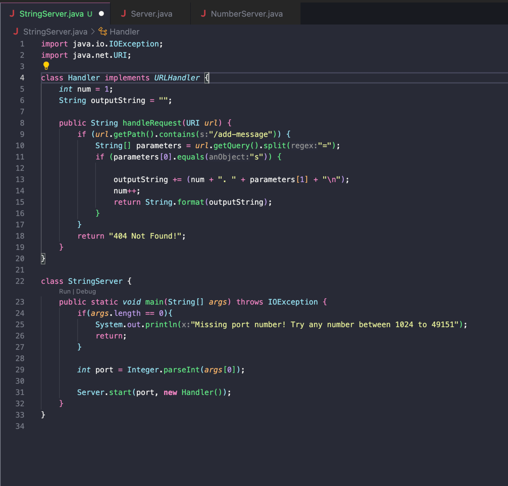
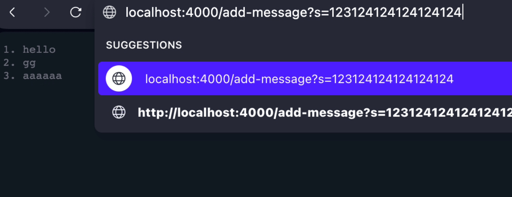
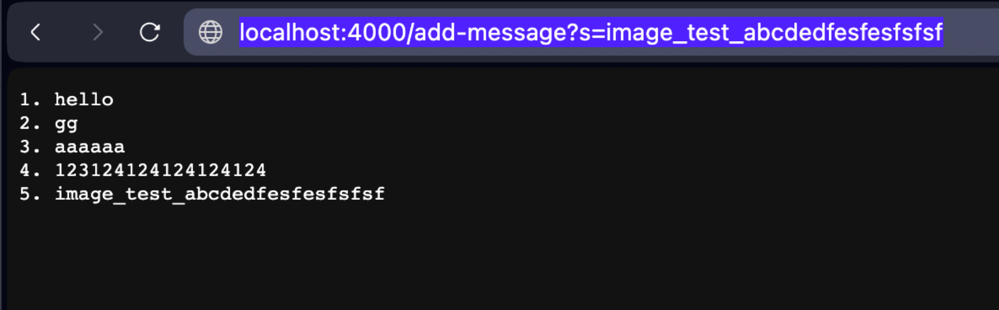

# Lab Report 2 - Servers and SSH Keys

Code for ```StringServer``` and ```Server```



I used the Server file provided from the previous lab assignment.

#Example Calls




Which methods in your code are called? 
What are the relevant arguments to those methods, and the values of any relevant fields of the class? 
How do the values of any relevant fields of the class change from this specific request? If no values got changed, explain why.

For both examples, we start off by running the main method of the ```StringServer``` class, starting a server with port 4000 in my specific case, as the input String[] args will just be an array with a singular String ```4000```, and ```int port = Integer.parseInt("4000")```.

Example 1:
- The first method call is the start method of class Server, which creates a HttpServer object with socket at port 4000, and uses the Handler class in ```StringServer```.
```Server.start(4000, new Handler())```

- The HttpServer object, called server, calls a ```createContext``` method which allows it to take input, specifying paths using a forward slash character, and creates a ServerHttpHandler objects using the rules specified in the ```StringServer``` ```Handler``` class.
```Server.start(4000, new Handler())``` It will then start the server and print out a message to the terminal ```Server Started!```

- Next, I type this URL into my browser: ```localhost:4000/add-message?=123124124124124124``` Since we had declared the ```/``` context, it will read the next section as a path in the ```handleRequest``` method of ```StringServer.Handler```. It will see that it does indeed contain ```/add-message```, and it will accordingly get the parameters by splitting the equal sign, forming an array with the [0] element being `"s"` and [1] element being ```"123124124124124124"```. The following if statement will be true, as the value of the String s is indeed true when the ```.equals()``` method of the String class is called with the parameter "s". This will then continue evaluating the if statement of the block. At this point, we have two global parameters: ```int num = 1``` and ```outputString = ""```. It will read the current ```parameter[1]``` value, which is ```"123124124124124124"```, and concatenate a String in the format ```(num + ". " + parameters[1] + "\n')```, and add that to ```outputString```, which would be what is displayed within the page. Afterwards, ```num``` is incremented by 1, and the page is updated. 

- Next, the 

- Example 2:


